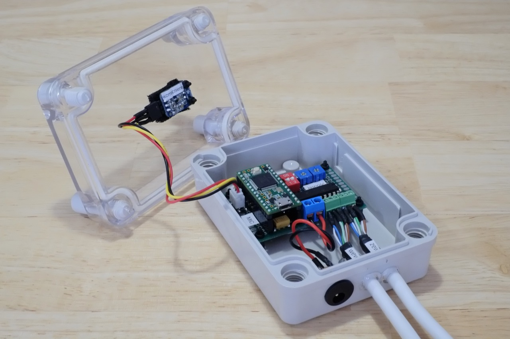

<a href="http://gz.technology" target="_blank"></a>

# Audio SPL level meter with led bargraph

This project is about measuring semi-calibrated [SPL](https://en.wikipedia.org/wiki/Sound_pressure#Sound_pressure_level) and mapping the value on two led bars 32 pixels each with separate brightness management.

## About The project

A sound is picked up with an electret microphone, processed and then SPL level calculated and mapped to a led bars.

#### Input

I used Adafruit MAX4466, modified as Pauls suggested in this __[thread](https://forum.pjrc.com/threads/40468-Help-with-Basic-Audio-Lib-results?p=126317&viewfull=1#post126317)__ to match Teensy input levels. The preamp output is connected directly to the Teensy AD input.

#### Microconroller
I have chosen the Teensy platform as this project is focused on audio and power consumption is not so main factor. The [Teensy 3.2](https://www.pjrc.com/teensy/teensy31.html) has got 32bit Cortex-M4 ARM processor running on 72MHz, DMA and 16bit AD converter which makes it a perfect for this application IMHO.
The only drawback I have discovered during prototyping is that it is not possible to use analogRead on other AD inputs while using audio library. An external AD ADS1015 was added ad-hoc to read pots which are used for LEDs brightness adjustment.

#### Output
Neopixels tapes are connected via 74HCT245 buffer.

#### Construction

All components soldered on universal PCB. Two pots are for manual brightness adjustment, dip switch for optional test mode. On bottom, power supply input and two cat5 for LED strips. The Cat5 delivers data and power to each of the LED stripes.



## How It Works
To compute SPL, the microcontroller does:
- converts analog input signal from mic preamp
- applies Hanning window
- calculates 1024 points FFT
- applies A-weighting curve
- compute the SPL using RMS value
- map SPL level to 32 points bargraph

## Schematic
External elements (dip switch, two 10k pots, 74HCT245 etc) connected to teensy as declared in code.

## Built With
* [Atom](https://atom.io) - An amazing text editor
* [PlatformIO](https://platformio.org) - An ecosystem for embedded development
* [Audio System Design Tool for Teensy Audio Library](https://www.pjrc.com/teensy/gui/) - drag and drop tool for quick implementation an audio system
* [Teensy Loader Application](https://www.pjrc.com/teensy/loader.html) - for uploading firmware to Teensy microcontroler

## Usage / Prerequisites
Connect breakboards modules to the Teensy as declared in code.

Clone the repository to a local folder
```bash
git clone https://github.com/g-zajac/audio-level-meter-with-led-bargraph.git
```
enter the project folder and run command:
```bash
platformio run
```
Project configuration is set in platformio.ini where you can set up variuos environmets and options.

Upload the compiled code to the Teensy, no programmer needed as has got build in USB and bootloader.

## Performance
CPU loaded @ 65%

## Acknowledgments
Big thanks for inspiration and sharing your knowledge and code:
- [@PaulStoffregen](https://github.com/PaulStoffregen)
- Thijs Schrama - PJRC (Teensy) Forum [thread](https://forum.pjrc.com/threads/34371-Teensy-3-2-Sound-Level-Meter-(sound-measurement-device))

## License
This project is licensed under [MIT license](http://opensource.org/licenses/mit-license.php)

## Project status
- Prototype built and tested.
- Firmware R1 completed.
